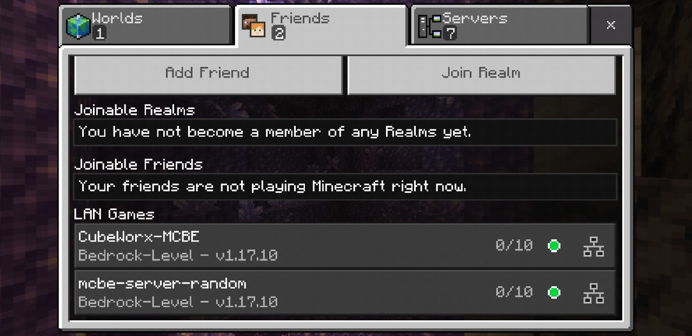
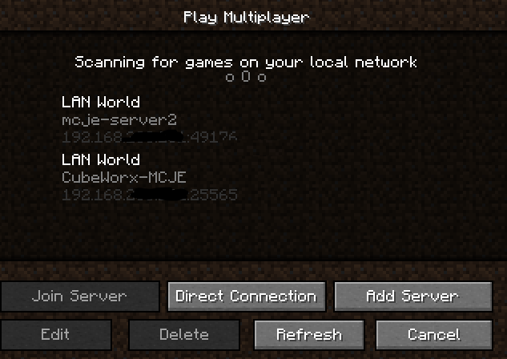

[](https://github.com/cubeworx/cbwxannounce/actions)
[](https://hub.docker.com/r/cubeworx/cbwxannounce)
[](https://hub.docker.com/r/cubeworx/cbwxannounce)
[](https://hub.docker.com/r/cubeworx/cbwxannounce)
[](https://github.com/cubeworx/cbwxannounce/blob/master/LICENSE)
[](https://twitter.com/intent/follow?screen_name=cubeworx)

CubeWorx Minecraft Server LAN Announcer Image
==============

This image is a Minecraft server announcer to make it easier to discover multiple Minecraft servers running in Docker on the same host. It is intended for use in the upcoming CubeWorx ecosystem but is also being provided for use in the Minecraft community.

## Usage

While intended for use with one of the CubeWorx Minecraft Server images, it can be used with other Minecraft Server docker images with the below configurations. In order to run multiple servers on the same host you will need to change from the default exposed Docker port. You can either specify one or let Docker choose one automatically and cbwxannounce will find them and make them discoverable under LAN games.

### Bedrock Edition

Bedrock Server containers must be ran on the same network (i.e.: bridge) as the cbwxannounce container in order for them to be discovered.

Make sure the `SERVER_NAME` environment variable is present and add the following labels to each running container:

- `cbwx.announce.enable="true"`
- `cbwx.announce.type="mcbe"`

You can then launch the image with the following command:

```
docker run -d -it -p 19132:19132/udp -v /var/run/docker.sock:/var/run/docker.sock cubeworx/cbwxannounce
```
Or with docker-compose:

```
version: '3.8'
services:
  cbwxannounce:
    image: cubeworx/cbwxannounce
    network_mode: bridge
    ports:
    - 19132:19132/udp
    stop_grace_period: 30s
    restart: unless-stopped
    stdin_open: true
    tty: true
    logging:
      driver: json-file
      options:
        max-size: "50m"
        max-file: "10"
```


### Java Edition

The container must be ran in host mode so that the container can broadcast on the local network to port 4445.

Make sure the `SERVER_NAME` environment variable is present and add the following labels to each running container:

- `cbwx.announce.enable="true"`
- `cbwx.announce.type="mcje"`

You can then launch the image with the following command:

```
docker run -d -it --network=host -v /var/run/docker.sock:/var/run/docker.sock cubeworx/cbwxannounce
```

Or with docker-compose:

```
version: '3.8'
services:
  cbwxannounce:
    image: cubeworx/cbwxannounce
    network_mode: host
    stop_grace_period: 30s
    restart: unless-stopped
    stdin_open: true
    tty: true
    logging:
      driver: json-file
      options:
        max-size: "50m"
        max-file: "10"
```



## CubeWorx Minecraft Server Proxy

When used with [cbwxproxy](https://github.com/cubeworx/cbwxproxy), cbwxannounce can broadcast remote servers to make them discoverable on your local network. As long as they have a different name and external port, muliple proxy containers can be ran and they will appear on the local LAN. This image is currently only compatible with Java Edition proxied servers but we hope to get Bedrock Edition proxied servers working soon.

## Thanks

This application was origionally cloned from [manymine](https://github.com/illiteratealliterator/manymine) and [node-advertiser](https://github.com/flareofghast/node-advertiser) and functionalities combined to be compatible with both Bedrock Edition & Java Edition servers.

